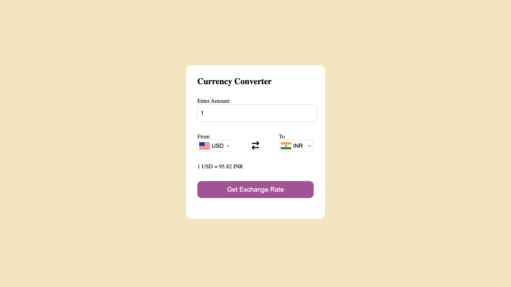

# Currency Converter 💱

A simple, fast, and responsive Currency Converter web application built with vanilla HTML, CSS, and JavaScript. This project allows users to check real-time exchange rates between different global currencies.

**Live Demo:** https://currency-converter-eight-pearl.vercel.app/

## ✨ Features
- **Real-Time Exchange Rates:** Fetches up-to-date currency conversion rates using the [Frankfurter API](https://www.frankfurter.app/).
- **Interactive UI:** Clean and intuitive user interface for selecting currencies and entering amounts.
- **Dynamic Country Flags:** Automatically updates the country flag icons based on the selected currency using [FlagsAPI](https://flagsapi.com/).
- **Responsive Design:** Fully responsive layout that looks great on desktops, tablets, and mobile devices.

## 🛠️ Technologies Used
- **HTML5:** Semantic structure of the web page.
- **CSS3:** Custom styling and layout (Flexbox).
- **JavaScript (ES6):** Async/Await for API fetching and DOM manipulation.
- **External APIs:** 
  - [Frankfurter API](https://api.frankfurter.dev/v1/latest) for live currency data.
  - [FlagsAPI](https://flagsapi.com/) for country flag images.
  - [FontAwesome](https://fontawesome.com/) for UI icons.

## 🚀 How to Run Locally
Since this is a static frontend project, no complex installation is required.

1. Clone this repository:
   ```bash
   git clone https://github.com/abhishekvarma149/Currency-Converter.git
   ```
2. Navigate to the project folder:
   ```bash
   cd currency-converter
   ```
3. Open the `index.html` file in your preferred web browser, or use a tool like **VS Code Live Server** for the best development experience.

## 📸 Preview



---
*Built while learning web development.*
